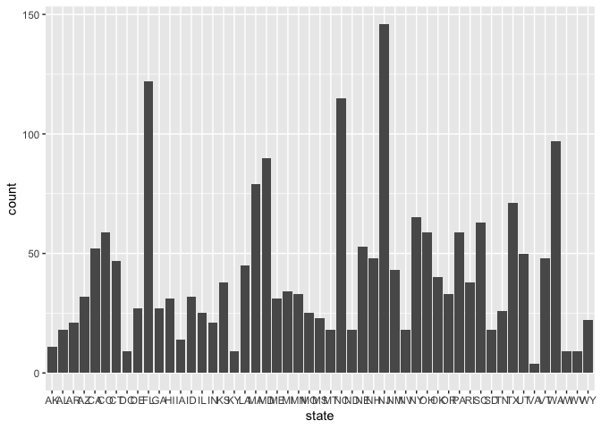
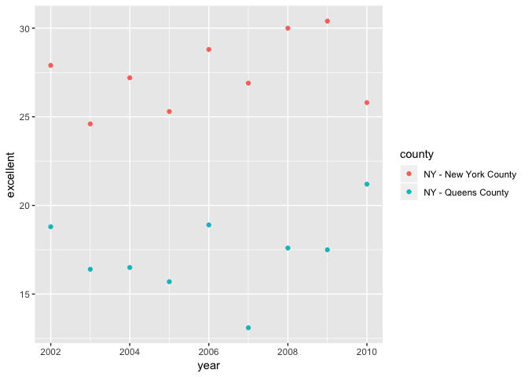

p8105\_hw2\_lz2586
================
Lyuou Zhang
9/29/2018

## Problem 1

``` r
# Import transit data and data cleaning
transit <- read_csv(file = './data/NYC_Transit_Subway_Entrance_And_Exit_Data.csv') %>% 
  janitor::clean_names() %>% 
  select(line, station_name, lat = station_latitude, long = station_longitude, route1:entry, vending, ada) %>% 
  mutate(entry = recode(entry, 'YES' = TRUE, 'NO' = FALSE))
```

    ## Parsed with column specification:
    ## cols(
    ##   .default = col_character(),
    ##   `Station Latitude` = col_double(),
    ##   `Station Longitude` = col_double(),
    ##   Route8 = col_integer(),
    ##   Route9 = col_integer(),
    ##   Route10 = col_integer(),
    ##   Route11 = col_integer(),
    ##   ADA = col_logical(),
    ##   `Free Crossover` = col_logical(),
    ##   `Entrance Latitude` = col_double(),
    ##   `Entrance Longitude` = col_double()
    ## )

    ## See spec(...) for full column specifications.

``` r
summary(transit)
```

    ##      line           station_name            lat             long       
    ##  Length:1868        Length:1868        Min.   :40.58   Min.   :-74.03  
    ##  Class :character   Class :character   1st Qu.:40.69   1st Qu.:-73.99  
    ##  Mode  :character   Mode  :character   Median :40.73   Median :-73.96  
    ##                                        Mean   :40.73   Mean   :-73.94  
    ##                                        3rd Qu.:40.77   3rd Qu.:-73.91  
    ##                                        Max.   :40.90   Max.   :-73.76  
    ##                                                                        
    ##     route1             route2             route3         
    ##  Length:1868        Length:1868        Length:1868       
    ##  Class :character   Class :character   Class :character  
    ##  Mode  :character   Mode  :character   Mode  :character  
    ##                                                          
    ##                                                          
    ##                                                          
    ##                                                          
    ##     route4             route5             route6         
    ##  Length:1868        Length:1868        Length:1868       
    ##  Class :character   Class :character   Class :character  
    ##  Mode  :character   Mode  :character   Mode  :character  
    ##                                                          
    ##                                                          
    ##                                                          
    ##                                                          
    ##     route7              route8          route9         route10    
    ##  Length:1868        Min.   :1.000   Min.   :2.000   Min.   :3     
    ##  Class :character   1st Qu.:1.000   1st Qu.:2.000   1st Qu.:3     
    ##  Mode  :character   Median :4.000   Median :2.000   Median :3     
    ##                     Mean   :2.979   Mean   :2.536   Mean   :3     
    ##                     3rd Qu.:5.000   3rd Qu.:2.000   3rd Qu.:3     
    ##                     Max.   :5.000   Max.   :5.000   Max.   :3     
    ##                     NA's   :1820    NA's   :1840    NA's   :1845  
    ##     route11     entrance_type        entry           vending         
    ##  Min.   :7      Length:1868        Mode :logical   Length:1868       
    ##  1st Qu.:7      Class :character   FALSE:115       Class :character  
    ##  Median :7      Mode  :character   TRUE :1753      Mode  :character  
    ##  Mean   :7                                                           
    ##  3rd Qu.:7                                                           
    ##  Max.   :7                                                           
    ##  NA's   :1845                                                        
    ##     ada         
    ##  Mode :logical  
    ##  FALSE:1400     
    ##  TRUE :468      
    ##                 
    ##                 
    ##                 
    ## 

``` r
dim(transit)
```

    ## [1] 1868   19

``` r
# Route 8, 9, 10 and 11 are imported as numeric. Need to be converted to character.
transit$route8 <- as.character(transit$route8)
transit$route9 <- as.character(transit$route9)
transit$route10 <- as.character(transit$route10)
transit$route11 <- as.character(transit$route11)

# maybe it would be better to convert vending to logical too
transit <- mutate(transit, vending = recode(vending, 'YES' = TRUE, 'NO' = FALSE))
# distinct stations
d_transit <- distinct(transit, line, station_name, ada)
summary(d_transit)
```

    ##      line           station_name          ada         
    ##  Length:465         Length:465         Mode :logical  
    ##  Class :character   Class :character   FALSE:381      
    ##  Mode  :character   Mode  :character   TRUE :84

``` r
# There are 465 distinct stations, and 84 of them are ADA compliant.
# proportion of station antrances/exits without vending allow entrance
filter(transit, vending == FALSE & entry == TRUE)
```

    ## # A tibble: 69 x 19
    ##   line  station_name   lat  long route1 route2 route3 route4 route5 route6
    ##   <chr> <chr>        <dbl> <dbl> <chr>  <chr>  <chr>  <chr>  <chr>  <chr> 
    ## 1 4 Av… 9th St        40.7 -74.0 F      G      R      <NA>   <NA>   <NA>  
    ## 2 6 Av… 7th Av        40.7 -74.0 F      <NA>   <NA>   <NA>   <NA>   <NA>  
    ## 3 6 Av… 7th Av        40.7 -74.0 F      <NA>   <NA>   <NA>   <NA>   <NA>  
    ## 4 6 Av… 7th Av        40.7 -74.0 F      <NA>   <NA>   <NA>   <NA>   <NA>  
    ## 5 6 Av… 7th Av        40.7 -74.0 F      <NA>   <NA>   <NA>   <NA>   <NA>  
    ## # ... with 64 more rows, and 9 more variables: route7 <chr>, route8 <chr>,
    ## #   route9 <chr>, route10 <chr>, route11 <chr>, entrance_type <chr>,
    ## #   entry <lgl>, vending <lgl>, ada <lgl>

``` r
filter(transit, vending == FALSE)
```

    ## # A tibble: 183 x 19
    ##   line  station_name   lat  long route1 route2 route3 route4 route5 route6
    ##   <chr> <chr>        <dbl> <dbl> <chr>  <chr>  <chr>  <chr>  <chr>  <chr> 
    ## 1 4 Av… 53rd St       40.6 -74.0 R      <NA>   <NA>   <NA>   <NA>   <NA>  
    ## 2 4 Av… 77th St       40.6 -74.0 R      <NA>   <NA>   <NA>   <NA>   <NA>  
    ## 3 4 Av… 9th St        40.7 -74.0 F      G      R      <NA>   <NA>   <NA>  
    ## 4 4 Av… Bay Ridge Av  40.6 -74.0 R      <NA>   <NA>   <NA>   <NA>   <NA>  
    ## 5 42nd… Grand Centr…  40.8 -74.0 GS     4      5      6      7      <NA>  
    ## # ... with 178 more rows, and 9 more variables: route7 <chr>,
    ## #   route8 <chr>, route9 <chr>, route10 <chr>, route11 <chr>,
    ## #   entrance_type <chr>, entry <lgl>, vending <lgl>, ada <lgl>

``` r
# 69 of them are without vending but allow entrance. There are 183 station entrances/exits without vending.
69/183
```

    ## [1] 0.3770492

``` r
# tidying data cont.
transit_tidy <- gather(transit, key = route, value = train, route1:route11) 
transit_tidy <- separate(transit_tidy, route, into = c('remove', 'route'), sep = -1) %>%
  select(-remove)
transit_tidy_d <- distinct(transit_tidy, line, station_name, ada, train)
filter(transit_tidy_d, train == 'A')
```

    ## # A tibble: 60 x 4
    ##   line            station_name                  ada   train
    ##   <chr>           <chr>                         <lgl> <chr>
    ## 1 42nd St Shuttle Times Square                  FALSE A    
    ## 2 8 Avenue        125th St                      FALSE A    
    ## 3 8 Avenue        145th St                      FALSE A    
    ## 4 8 Avenue        14th St                       TRUE  A    
    ## 5 8 Avenue        168th St - Washington Heights TRUE  A    
    ## # ... with 55 more rows

``` r
filter(transit_tidy_d, train == 'A' & ada == TRUE)
```

    ## # A tibble: 17 x 4
    ##    line             station_name                  ada   train
    ##    <chr>            <chr>                         <lgl> <chr>
    ##  1 8 Avenue         14th St                       TRUE  A    
    ##  2 8 Avenue         168th St - Washington Heights TRUE  A    
    ##  3 8 Avenue         175th St                      TRUE  A    
    ##  4 8 Avenue         34th St                       TRUE  A    
    ##  5 8 Avenue         42nd St                       TRUE  A    
    ##  6 8 Avenue         59th St                       TRUE  A    
    ##  7 8 Avenue         Inwood - 207th St             TRUE  A    
    ##  8 8 Avenue         West 4th St                   TRUE  A    
    ##  9 8 Avenue         World Trade Center            TRUE  A    
    ## 10 Broadway         Times Square-42nd St          TRUE  A    
    ## 11 Broadway-7th Ave 59th St-Columbus Circle       TRUE  A    
    ## 12 Broadway-7th Ave Times Square                  TRUE  A    
    ## 13 Canarsie         8th Av                        TRUE  A    
    ## 14 Franklin         Franklin Av                   TRUE  A    
    ## 15 Fulton           Euclid Av                     TRUE  A    
    ## 16 Fulton           Franklin Av                   TRUE  A    
    ## 17 Rockaway         Howard Beach                  TRUE  A

``` r
# 60 distinct stations serve the A train, and 17 of them are ADA compliant
```

I have imported the dataset, cleaned the names, convert variables with
“yes” or “no” to logical variables, and selected the variables that I
need. I also converted the routes that were tought to be numeric by R to
character. Now the dataset contains line, station name, the coordinates
of each station, entrance type, entry, vending, ada compliance and train
routes. Before I tidy the dataset, the dimension is
1868(row)\*19(column). These data is not tidy.

Answer for the questions:  
\* There are **465** distinct stations.  
\* **84** of these stations are ADA compliant.  
\* **37.7** of stations entrances/exits without vending allow entrance.

After I tidy the data so that route number and route name are distinct
variables:  
\* **60** distinct stations serve the A train.  
\* Of the stations that serve the A train, **17** of them are ADA
compliant.

## Problem 2

``` r
# Import the Trash Wheel sheet data and data cleaning
trashwheel <- read_excel('./data/HealthyHarborWaterWheelTotals2018-7-28.xlsx', sheet = 'Mr. Trash Wheel', range = 'A2:N338') %>% 
  janitor::clean_names() %>% 
  filter(!is.na(dumpster)) %>% 
  mutate(spball_round = round(sports_balls, digits = 0))
# Convert the rounded sports ball variable to integer
trashwheel$spball_round <- as.integer(trashwheel$spball_round)

# Import and clean precipitation data
# precipitation 2016
precip_16 <- read_excel('./data/HealthyHarborWaterWheelTotals2018-7-28.xlsx', sheet = '2016 Precipitation', range = 'A2:B14') %>% 
  janitor::clean_names() %>% 
  mutate(year = '2016') %>% 
  rename(precip = 'total')


# precipitation 2017
precip_17 <- read_excel('./data/HealthyHarborWaterWheelTotals2018-7-28.xlsx', sheet = '2017 Precipitation', range = 'A2:B14') %>% 
  janitor::clean_names() %>% 
  mutate(year = '2017') %>% 
  rename(precip = 'total') %>% 
  filter(!is.na(precip))

# Combine datasets
precip_j <- bind_rows(precip_16, precip_17)
precip_j$month <- as.character(month.name[precip_j$month])
sum(precip_17$precip)
```

    ## [1] 32.93

``` r
# I made a subset of data in year 2016. And calculated the median using both sports balls and the rounded sports balls.
dump_16 <- filter(trashwheel, year == '2016')
median(dump_16$sports_balls)
```

    ## [1] 26

``` r
median(dump_16$spball_round)
```

    ## [1] 26

``` r
# The results are both 26.
```

After cleaning, Mr. Trash Wheel dataset has **285** observations. It has
the dumpster number, the date, month and year of the observation, the
amount of trash measured by weight and by volume, and the amount of
trash of each category (plastic bottles, cigarette butts, glass bottles,
etc.)

I also joined the precipitation data in 2016 and 2017 in a dataset
called “precip\_j”. There are **24** observations. This dataset has the
precipitation data every month from 2016 to 2017.

The total precipitation in 2017 is **32.93**. The median number of
sports balls in dumpster in 2016 is **26**.

## Problem 3

``` r
# I installed the packages, and brfss_smart2010 is already built in. 
# Data cleaning. I rename the variables, filter the observations by topic (overall health), select the variables, tidy the data and create a variable that sums up "excellent" and "good" responses. 
head(brfss_smart2010)
```

    ## # A tibble: 6 x 23
    ##    Year Locationabbr Locationdesc  Class  Topic   Question       Response 
    ##   <int> <chr>        <chr>         <chr>  <chr>   <chr>          <chr>    
    ## 1  2010 AL           AL - Jeffers… Healt… Overal… How is your g… Excellent
    ## 2  2010 AL           AL - Jeffers… Healt… Overal… How is your g… Very good
    ## 3  2010 AL           AL - Jeffers… Healt… Overal… How is your g… Good     
    ## 4  2010 AL           AL - Jeffers… Healt… Overal… How is your g… Fair     
    ## 5  2010 AL           AL - Jeffers… Healt… Overal… How is your g… Poor     
    ## 6  2010 AL           AL - Jeffers… Healt… Fair o… Health Status… Good or …
    ## # ... with 16 more variables: Sample_Size <int>, Data_value <dbl>,
    ## #   Confidence_limit_Low <dbl>, Confidence_limit_High <dbl>,
    ## #   Display_order <int>, Data_value_unit <chr>, Data_value_type <chr>,
    ## #   Data_Value_Footnote_Symbol <chr>, Data_Value_Footnote <chr>,
    ## #   DataSource <chr>, ClassId <chr>, TopicId <chr>, LocationID <chr>,
    ## #   QuestionID <chr>, RESPID <chr>, GeoLocation <chr>

``` r
brfss_tidy <- janitor::clean_names(brfss_smart2010)
brfss_tidy <- brfss_tidy %>% 
  rename(state = 'locationabbr', county = 'locationdesc') %>% 
  mutate(topic = tolower(topic), response = tolower(response)) %>% 
  filter(topic == 'overall health') %>% 
  select(-(class:question), -sample_size, -(confidence_limit_low:geo_location)) %>% 
  spread(key = response, value = data_value) %>% 
  janitor::clean_names() %>% 
  mutate(excellent_or_very_good = excellent + very_good)

# Use distinct() to find distinct locations and states 
distinct(brfss_tidy, county)
```

    ## # A tibble: 404 x 1
    ##   county                     
    ##   <chr>                      
    ## 1 AK - Anchorage Municipality
    ## 2 AL - Jefferson County      
    ## 3 AR - Pulaski County        
    ## 4 AZ - Maricopa County       
    ## 5 AZ - Pima County           
    ## # ... with 399 more rows

``` r
distinct(brfss_tidy, state)
```

    ## # A tibble: 51 x 1
    ##   state
    ##   <chr>
    ## 1 AK   
    ## 2 AL   
    ## 3 AR   
    ## 4 AZ   
    ## 5 CA   
    ## # ... with 46 more rows

``` r
# Use a bar chart to find out the state which is represented the most
ggplot(brfss_tidy, aes(x = state)) + geom_bar(stat = 'count')
```

<!-- -->

``` r
ggsave('count_by_state.jpeg')
```

    ## Saving 7 x 5 in image

``` r
# I'm also able to find out the exact count for each state.
brfss_tidy %>% 
  group_by(state) %>% 
  count()
```

    ## # A tibble: 51 x 2
    ## # Groups:   state [51]
    ##   state     n
    ##   <chr> <int>
    ## 1 AK       11
    ## 2 AL       18
    ## 3 AR       21
    ## 4 AZ       32
    ## 5 CA       52
    ## # ... with 46 more rows

``` r
# New Jersey has the most observations (146).

# Use group_by to find the median of excellent responses in 2002 
brfss_tidy %>% 
  group_by(year) %>% 
  summarize(median_exc = median(excellent, na.rm = T))
```

    ## # A tibble: 9 x 2
    ##    year median_exc
    ##   <int>      <dbl>
    ## 1  2002       23.6
    ## 2  2003       23.7
    ## 3  2004       22.2
    ## 4  2005       21.6
    ## 5  2006       22.2
    ## 6  2007       21.4
    ## 7  2008       21.8
    ## 8  2009       21.5
    ## 9  2010       21.2

``` r
# The histogram of "excellent" response values in 2002 
# filter the data by year = 2002 and then use ggplot to make the histogram
brfss_tidy %>% 
  filter(year == '2002') %>% 
  ggplot(aes(x = excellent)) + geom_histogram()
```

    ## `stat_bin()` using `bins = 30`. Pick better value with `binwidth`.

    ## Warning: Removed 2 rows containing non-finite values (stat_bin).

<!-- -->

``` r
ggsave('hist_excellent.jpeg')
```

    ## Saving 7 x 5 in image

    ## `stat_bin()` using `bins = 30`. Pick better value with `binwidth`.

    ## Warning: Removed 2 rows containing non-finite values (stat_bin).

``` r
# Scatterplot showing the proportion of 'excellent' response valus in New York County and Queens County 
# filter the data by county and use ggplot 
brfss_tidy %>% 
  filter(county == 'NY - New York County' | county == 'NY - Queens County') %>% 
  ggplot(aes(x = year, y = excellent, color = county)) + geom_point()
```

<!-- -->

``` r
ggsave('point_nyq.jpeg')
```

    ## Saving 7 x 5 in image

  - I used distinct() to find unique county or state. There are **404**
    unique locations in the dataset. Because there are **51** unique
    values in “state”, every state is represented (including Washington
    D.C.). I made a bar chart to see the distribution of observations in
    each state. New Jersey is observed the most. I also used group\_by()
    then count() to see the exact number of observations of New Jersey.
    It’s **146**.

  - I used filter() to make a subset of BRFSS data which only contains
    data in 2002. The median of the ‘excellent’ respsonse value is
    **23.6** (there are two missing values that are removed).
